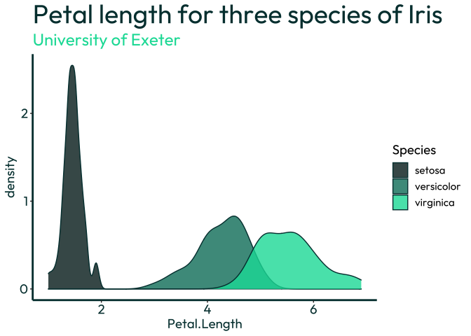

<!-- README.md is generated from README.Rmd. Please edit that file -->

# gguniversity

`gguniversity` provides additional themes and palettes for ggplot
visualisations, based on branding from major UK universities.

Feel free to contact me with comments, suggestions or requests: <br />
LinkedIn: [@dougal-toms](https://www.linkedin.com/in/dougal-toms/)<br />
Twitter: [@DougalToms](https://www.twitter.com/DougalToms)

## Installation

`gguniversity` can be installed through GitHub

``` r
install.packages("devtools")
devtools::install_github("dougaltoms/gguniversity")
```

A corresponding colour palette with `n` number of colours can be
generated for your `ggplot2` visualisations, using the
`<university>_palette()` function:

``` r
library(gguniversity)
library(scales)

exe_pal <- gguniversity::exeter_palette(16)

scales::show_col(exe_pal, ncol = 4, border=NA)
```

<!-- -->

## Examples

``` r
library(ggplot2)

ggplot(iris, aes(x = Petal.Length, fill = Species)) +
  geom_density(alpha = 0.8)+
  scale_fill_manual(values=gguniversity::exeter_palette(3))+
  labs(title="Petal length for three species of Iris", subtitle = "University of Exeter")+
  gguniversity::theme_exeter()
```

<!-- -->
